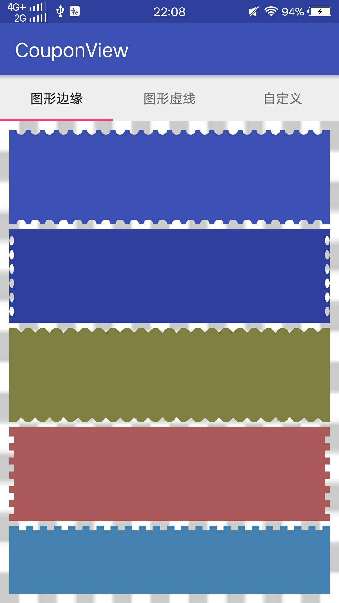
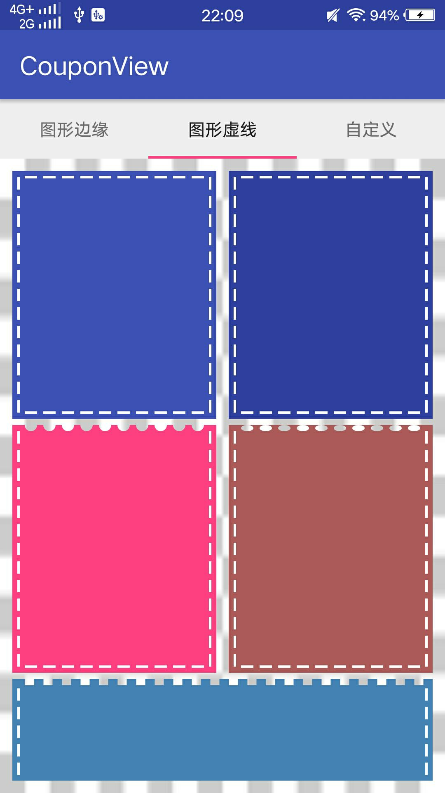
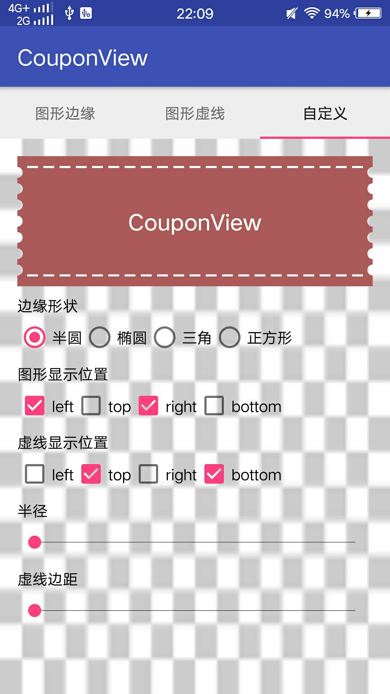
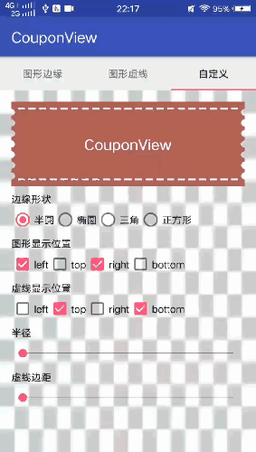

# CouponView 最好的优惠卷View，没有之一

## Feature:
- 提供了4种边缘图案（圆形，椭圆，三角，正方）
- 可自定义灵活的api支持
- 以剪裁的方案切入，可展示覆盖在下面的背景图
- 使用模板方法设计模式完成本例

## preview


 需要要自定义，可查看这个例子

<div width="100%" align="center"></div>
 

# Use:
### 1.Gradle
```
implementation 'com.github.xwc:couponView:1.0.0'
```

### 2.1 在xml设置属性
```
    <com.github.xwc.view.CouponView
        android:layout_width="0dp"
        android:layout_height="200dp"
        android:layout_marginLeft="5dp"
        android:layout_weight="1"
        app:bgc="#303F9F"
        app:dashGap="5dp"
        app:dashWidth="5dp"
        app:lineColor="#FFA500"
        app:isDrawBottomLine="true"
        app:isDrawLeftLine="true"
        app:isDrawRightLine="true"
        app:isDrawTopLine="true">

            <!-- YOU content  -->

    </com.github.xwc.view.CouponView>
```

### 2.2 在java设置属性
```
  couponView.setDrawType(CouponView.CIRCLE)
     .setBgc(Color.parseColor("#AD5A5A"))
     .setDashGap(dpToPx(5))
     .setDashWidth(dpToPx(5))
     .setDrawRightShape(true)
     .setDrawLeftShape(true)
     .setDrawTopLine(true)
     .setDrawBottomLine(true)
     .setLineMarginBottom(dpToPx(10))
     .setLineMarginTop(dpToPx(10))
     .setLineMarginLeft(dpToPx(10))
     .setLineMarginRight(dpToPx(10))
     .setLineColor(Color.WHITE);
```

### 自定义属性说明

属性名 | 说明 | 默认值
:----------- | :----------- | :-----------
dashGap         | 边缘图形间隙        | 5
dashWidth         | 边缘图形半径        | 10px
bgc         | 背景色        | #C0C0C0
isDrawTopShape         | 是否绘制上边边缘的图形            | false
drawShapeType         | 边缘图形类型        | circle
isDrawLeftShape         | 是否绘制左边边缘的图形        | false
isDrawRightShape         | 是否绘制右边边缘的图形        | false
isDrawTopShape         | 是否绘制上边边缘的图形            | false
isDrawBottomShape         | 是否绘制下边边缘的图形           | false
lineColor         | 虚线颜色        | Color.WHITE
lineWidth         | 虚线宽度        | 2dp
isDrawLeftLine         | 是否绘制左边边缘的虚线        | false
isDrawRightLine         | 是否绘制右边边缘的虚线        | false
isDrawTopLine         | 是否绘制上边边缘的虚线            | false
isDrawBottomLine         | 是否绘制下边边缘的虚线           | false
lineMarginTop         | 虚线距离自身顶部距离        | dashWidth
lineMarginBottom         | 虚线距离自身底部距离         | dashWidth
lineMarginLeft         | 虚线距离自身左边距离             | dashWidth
lineMarginRight         | 虚线距离自身右边距离            | dashWidth

## LICENSE
```
Copyright 2018 xwc

   Licensed under the Apache License, Version 2.0 (the "License");
   you may not use this file except in compliance with the License.
   You may obtain a copy of the License at

       http://www.apache.org/licenses/LICENSE-2.0

   Unless required by applicable law or agreed to in writing, software
   distributed under the License is distributed on an "AS IS" BASIS,
   WITHOUT WARRANTIES OR CONDITIONS OF ANY KIND, either express or implied.
   See the License for the specific language governing permissions and
   limitations under the License.
```
